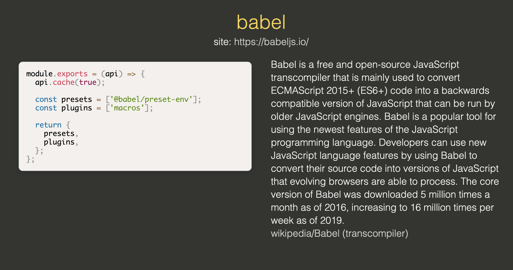

<div align="center">
  
</div>

<div align="center">
  <strong>A tool to create slides easily for you ✍ ️</strong>
</div>

<br />

[](https://www.npmjs.com/package/fusuma)
[](https://dev.azure.com/hiroppy/fusuma)
[](https://codecov.io/gh/hiroppy/fusuma)

## Features

- Zero Config
- Providing various modes
- Markdown and [MDX](https://github.com/mdx-js/mdx)
- Themes
- Code syntax Highlight, MathJax, Diagrams, and Flowcharts
- [Browser-friendly slides](#lighthouse)
  - All results for lighthouses are perfect
  - Full supporting for SEO and OGP
  - Checking [a11y(Accessibility)](https://developer.mozilla.org/en-US/docs/Glossary/Accessibility)
- Customizable JavaScript and CSS
- A sidebar having agenda and some features

## Modes

- Init Mode
  - Creating a slide, style, configuration file
  - Creating GitHub actions that deploy slides to gh-pages automatically
- Development Mode
  - Running with HMR
  - Just coding Markdown and sometimes CSS
- Build Mode
  - Rendering to html and optimizing js,css,md
  - Generating an image of slides as `og:image` and checking a11y automatically
- [Presentation Mode](#presenter-mode)
  - Speaker Note
  - Timer
  - Recording your page actions and voice
- Deploy Mode
  - Deploying to GitHub Pages
- PDF Mode
  - Exporting slides as PDF

## Demos

- [Introducing Fusuma](https://hiroppy.github.io/fusuma/intro) [[repository](/samples/intro)]
- [Themes](https://hiroppy.github.io/fusuma/themes/) [[repository](/samples/themes)]
- [Math, Diagrams, and Flowcharts](https://hiroppy.github.io/fusuma/advanced/) [[repository](/samples/advanced)]

[](https://gitpod.io/#https://github.com/hiroppy/fusuma/blob/master/samples/intro/slides/0-title.md)

## Getting Started

```shell
$ npm i fusuma -D
$ npx fusuma init
$ tree -a
.
├── .fusumarc.yml
├── .github
│   └── workflows
│       └── fusuma.yml
├── slides
│   └── 0-slide.md
└── style.css

# --- executable tasks---
$ npx fusuma init          # create scaffold
$ npx fusuma start         # run server for development
$ npx fusuma start-prod    # run server for bundle directory
$ npx fusuma build         # build slides for production
$ npx fusuma deploy        # deploy to github pages
$ npx fusuma pdf           # export as PDF
```

When `npx fusuma start` is executed, fusuma will create slides like follows on `http://localhost:8080`. In addition, Fusuma adds a sidebar and when you set section titles, fusuma shows them on the sidebar.

|              slides generated by `init`               |                 sidebar                  |
| :---------------------------------------------------: | :--------------------------------------: |
|  |  |

👉 [the demo](https://hiroppy.github.io/fusuma/plain/)

## Themes

Fusuma offers the following themes also users can customize them because this is just CSS.

|                     default                     |                     pop                     |
| :---------------------------------------------: | :-----------------------------------------: |
|  |  |

|                     webpack                     |                     babel                     |                     node                     |
| :---------------------------------------------: | :-------------------------------------------: | :------------------------------------------: |
|  |  |  |

👉 [the demo](https://hiroppy.github.io/fusuma/themes/)

## Markdown and MDX

```markdown
## Hello

This is the first slide.

---

## 🤭

import { Sample } from './scripts/Sample';

This is the second slide.

<Sample />
```

```js
// Sample.js
export const Sample = () => <p>Hello from jsx!!</p>;
```

## Customize styles

The following properties are provided, but you can change the css directly if you want.

<details>

```css
:root {
  --base-font-family: 'Roboto', 'San Francisco', helvetica, arial, sans-serif;
  --base-font-size: 2.4rem;
  --base-font-weight: 300;
  --base-align: center;
  --base-max-width: 1280px;
  --base-outer-margin: 24px;
  --base-image-height: auto;
  --base-image-width: 100%;
  --base-image-border: none;
  --base-image-border-radius: 0;

  --color-title: #464646;
  --color-base: #545454;
  --color-background: #f5f5f5;
  --color-link: #3498db;

  --h1-font-size: 5.6rem;
  --h1-font-weight: 300;
  --h2-font-size: 4rem;
  --h2-font-weight: 300;
  --h3-font-size: 3.6rem;
  --h3-font-weight: 300;
  --h4-font-size: 3rem;
  --h4-font-weight: 300;
  --h5-font-size: 2.4rem;
  --h5-font-weight: 600;
  --h6-font-size: 2rem;
  --h6-font-weight: 600;

  --account-icon-size: 3rem;
  --account-icon-color: #545454;
  --code-font-size: 1.8rem;
  --qr-code-image-size: 320px;
}
```

</details>

## Presenter Mode

This feature uses experimental APIs so please use Chrome or Firefox.

- [Presentation API](https://developer.mozilla.org/en-US/docs/Web/API/Presentation_API) (Chrome, Firefox)
- [Screen Capture API](https://developer.mozilla.org/en-US/docs/Web/API/Screen_Capture_API/Using_Screen_Capture) (Chrome, Firefox)

You can see your Note for each slide and the next slide on the Host screen.


### Features

- Showing your slide notes
- Setting a timer
- Recording your actions and voice, and doing time-travel
  - video: [Recording Your Voice](https://hiroppy.github.io/fusuma/docs/modes/presenter#recording-your-voice)


## Lighthouse

> [Lighthouse](https://developers.google.com/web/tools/lighthouse) is an open-source, automated tool for improving the quality of web pages. You can run it against any web page, public or requiring authentication. It has audits for performance, accessibility, progressive web apps, SEO and more.

Fusuma supports improving performance, SEO, and so on as default.


---

## Special Thanks to

### Themes

I respect your UI and I really love it. I usually talk about you in Japan so I added your colors to Fusuma. If you have issues, feel free to mention me! Thank you.

- Node.js
- webpack
- Babel
